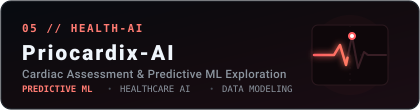
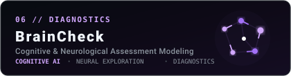
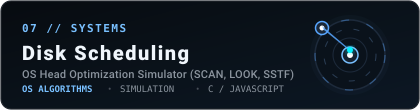

<div align="center">

<!-- HERO BANNER -->
<a href="https://github.com/Priya-Ranjan-0201">
  
</a>

<br/><br/>

<!-- TYPING ANIMATION (readme-typing-svg) -->
<a href="https://github.com/Priya-Ranjan-0201">
  
</a>

<br/>

<!-- ACTION / SOCIAL ANCHORS -->
<p align="center">
  <a href="https://github.com/Priya-Ranjan-0201">
    
  </a>
  &nbsp;
  <a href="portfolio/">
    
  </a>
  &nbsp;
  <a href="https://www.linkedin.com/in/priyaranjan01/">
    
  </a>
  &nbsp;
  <a href="mailto:priye0201@gmail.com">
    
  </a>
</p>

</div>

---

### 01 // IDENTITY & THE STORY

```
WHO_I_AM:
├─ Name:         Priya Ranjan
├─ Discipline:   Computer Science & Engineering (B.Tech 2023–2027)
├─ Core Mindset: Problem-first engineering over buzzword chasing
├─ Focus Areas:  Intelligent Systems • Defensive Cybersecurity • Operating Systems & Full-Stack
└─ Philosophy:   "Ideas → Systems → Code → Impact"
```

> *"I like difficult problems. They create better questions. Better questions create better systems."*

I didn't grow up disassembling circuit boards in a machine workshop. My journey began with simple, stubborn curiosity: I wanted to understand what actually happens in the silent milliseconds between pressing <kbd>Enter</kbd> in a browser address bar and having a webpage appear on screen. 

Once I discovered network sockets, operating system processes, kernel scheduling, and algorithmic tradeoffs, I was hooked. It transformed computing from a black box into a machine built by human hands—one that I could learn to build, audit, and improve from first principles.

Today, I am a Computer Science & Engineering undergraduate building software that bridges **AI/ML**, **defensive cybersecurity**, and **systems architecture**. Whether evaluating AST syntax trees to bypass code execution vulnerabilities, visualizing disk arm kinematics, or architecting digital public infrastructure for Smart India Hackathon, I care deeply about how systems behave when pushed to their limits.

---

### 02 // HARD-WON LESSONS & FAILURE RETROSPECTIVES

Real engineering is learned through broken builds, dropped packets, and humbled assumptions:

<table>
<tr>
<td width="50%" valign="top">

#### ⚡ The Unbounded Connection Storm
**Project:** *TrustShield-X (Network Scanner)*

- **What Happened:** While scanning a subnet concurrently, I spawned hundreds of raw async sockets without enforcing a semaphore pool. Within 3 seconds, the runtime exhausted OS file descriptors, choked my local network interface, and froze the machine.
- **The Takeaway:** Concurrency without strict rate-limiting, bounded pools, and deterministic timeouts is indistinguishable from a self-inflicted denial-of-service. Every network boundary I build now has strict limits.

</td>
<td width="50%" valign="top">

#### 🧩 The Premature Microservices Trap
**Project:** *VIREONIQ (Career Roadmap Engine)*

- **What Happened:** In an early prototype, I prematurely split the architecture into four separate microservices with an async message broker. I spent three weeks debugging Docker virtual network bridges and serialization latency rather than refining the core career graph algorithms.
- **The Takeaway:** Start with a clean, modular monolith. Extract distributed services only when computational bottlenecks demand it—never for architectural vanity.

</td>
</tr>
</table>

---

### 03 // THE ENGINEERING PIPELINE

<div align="center">
  
</div>

```
01 // FIND THE REAL PROBLEM      Never patch a superficial symptom when the architectural root remains untouched.
02 // DRAW BEFORE YOU CODE       Map state machines, database schemas, and failure states on paper first.
03 // BUILD THE SMALLEST CORE    Validate technical hypotheses with minimal, functioning prototypes.
04 // BREAK YOUR OWN CODE        Fuzz inputs, inject packet latency, and test edge cases under stress.
05 // OPTIMIZE WITH TELEMETRY    Measure with profilers and benchmark suites—never optimize through guesswork.
06 // RESPONSIBLE STEWARDSHIP    Deploy with automated health checks, atomic commits, and clear documentation.
```

---

### 04 // CURRENTLY BUILDING

Active flagship engineering projects undergoing active architecture and feature iterations:

<table>
<tr>
<td width="50%" valign="top">

#### 🚀 [VIREONIQ](https://github.com/Priya-Ranjan-0201/VIREONIQ)
**Developer Career Roadmap & AST Code Analysis Engine**

- **Why It Exists:** Traditional hiring platforms rely on shallow keyword matching, rewarding buzzword-stuffed resumes rather than verified structural coding ability.
- **How It Works:** Uses Python Abstract Syntax Trees (AST) to evaluate code complexity without vulnerable runtime execution, coupled with Qdrant vector similarity for semantic career trajectory mapping.
- **Engineering Status:** Validated with 153/153 passing automated test suites across FastAPI endpoints, AST visitors, and vector searches.

<br/>

👉 **[Inspect Repository →](https://github.com/Priya-Ranjan-0201/VIREONIQ)**

</td>
<td width="50%" valign="top">

#### 🛡️ [TrustShield-X](https://github.com/Priya-Ranjan-0201/TrustShield-X)
**High-Speed Concurrent Network & Threat Intelligence Engine**

- **Why It Exists:** Web and network services are frequently exposed to misconfigured headers, unpatched ports, and weak TLS configurations.
- **How It Works:** Built on Python 3.13 AsyncIO for sub-15ms parallel socket checks, HTTP security header verification, and SHA-256 tamper-evident cryptographic audit logging.
- **Engineering Status:** Enforces 7 strict defensive security invariants with STIX 2.1 threat modeling integration.

<br/>

👉 **[Inspect Repository →](https://github.com/Priya-Ranjan-0201/TrustShield-X)**

</td>
</tr>
</table>

---

### 05 // SELECTED PROJECTS & ARCHITECTURES

A curated index of public engineering repositories, system simulations, and research prototypes:

<table width="100%">
<tr>
<td width="50%" valign="top">

<a href="https://github.com/Priya-Ranjan-0201/VIREONIQ">
  
</a>

**01 / VIREONIQ**  
Career intelligence OS combining Python AST static code inspection, 9-dimensional skill readiness modeling, and Qdrant vector retrieval.  
`Stack: Python • FastAPI • React 18 • Qdrant • Docker`  
🔗 **[View Repository](https://github.com/Priya-Ranjan-0201/VIREONIQ)**

</td>
<td width="50%" valign="top">

<a href="https://github.com/Priya-Ranjan-0201/TrustShield-X">
  
</a>

**02 / TrustShield-X**  
High-speed defensive security framework delivering sub-15ms multi-vector socket inspection, header auditing, and cryptographic audit trails.  
`Stack: Python 3.13 AsyncIO • Sockets • STIX 2.1 • Security`  
🔗 **[View Repository](https://github.com/Priya-Ranjan-0201/TrustShield-X)**

</td>
</tr>
<tr>
<td width="50%" valign="top">

<a href="https://github.com/Priya-Ranjan-0201/TECH-ON-TOUR">
  
</a>

**03 / TECH-ON-TOUR (TravelSathi)**  
India's Digital Public Infrastructure for Smart Tourism (Smart India Hackathon Grand Finale) — multilingual travel twin, anti-overtourism gatekeeper, and regional search graph.  
`Stack: React • FastAPI • Python • Leaflet • Search Graphs`  
🔗 **[View Repository](https://github.com/Priya-Ranjan-0201/TECH-ON-TOUR)**

</td>
<td width="50%" valign="top">

<a href="https://github.com/Priya-Ranjan-0201/HRCV-">
  
</a>

**04 / HRCV-**  
AI-powered career intelligence platform providing ATS compatibility scoring, NLP skill extraction, and candidate-role alignment analysis.  
`Stack: Python • React 19 • FastAPI • NLP • Scikit-Learn`  
🔗 **[View Repository](https://github.com/Priya-Ranjan-0201/HRCV-)**

</td>
</tr>
<tr>
<td width="50%" valign="top">

<a href="https://github.com/Priya-Ranjan-0201/Priocardix-AI">
  
</a>

**05 / Priocardix-AI**  
Enterprise preventive cardiology platform powered by PulseIQ Guardian Engine™ for multi-parametric risk assessment with explainable clinical attribution.  
`Stack: React • Zustand • Machine Learning • Healthcare AI`  
🔗 **[View Repository](https://github.com/Priya-Ranjan-0201/Priocardix-AI)**

</td>
<td width="50%" valign="top">

<a href="https://github.com/Priya-Ranjan-0201/BrainCheck">
  
</a>

**06 / BrainCheck**  
Containerized cognitive assessment and MCQ architecture platform engineered with decoupled Flask Blueprints, PostgreSQL schemas, and Docker microservices.  
`Stack: Flask • PostgreSQL • Docker Compose • Python`  
🔗 **[View Repository](https://github.com/Priya-Ranjan-0201/BrainCheck)**

</td>
</tr>
<tr>
<td colspan="2" valign="top">

<a href="https://github.com/Priya-Ranjan-0201/Disk_Scheduling_Algorithm">
  
</a>

**07 / Disk_Scheduling_Algorithm**  
Operating systems simulator implementing and benchmarking 11 classical disk arm scheduling algorithms (FCFS, SSTF, SCAN, C-SCAN, LOOK, C-LOOK) with 60 FPS HTML5 Canvas kinematics.  
`Stack: JavaScript • HTML5 Canvas • OS Storage Architecture • Algorithms`  
🔗 **[View Repository](https://github.com/Priya-Ranjan-0201/Disk_Scheduling_Algorithm)**

</td>
</tr>
</table>

---

### 06 // TECHNICAL TOOLBOX & STACK

Grounded in practical, day-to-day engineering usage:

```
[LANGUAGES]
 Python 3.11/3.13            JavaScript (ES6+)          TypeScript                 C (Systems / OS)

[FRAMEWORKS & ENGINES]
 FastAPI                    React 18 / 19              Next.js 15                 Flask Blueprints

[DATABASES & CACHE]
 PostgreSQL 16              Qdrant (Vector DB)         Redis 7                    MongoDB (2dsphere)

[SYSTEMS & INFRASTRUCTURE]
 Docker & Docker Compose    Linux / Bash / WSL2        Git & GitHub CI/CD         Nginx Reverse Proxy

[CORE CONCEPTS & FOCUS]
 Abstract Syntax Trees      Zero-Trust Security        OS Storage Kinematics      Search Graph Traversal
```

<div align="center">
  
</div>

---

### 07 // DAILY DESK & WORKFLOW

```
WORKSPACE & HARDWARE:
├─ Rig:          Windows Dev Workstation + WSL2 Linux for kernel experiments & Docker
├─ Keyboard:     Custom 75% Mechanical Keyboard (lubricated tactile switches & tuned stabilizers)
├─ Screen:       High-res IPS display scaled for side-by-side terminal splits
└─ Editor:       VS Code (minimal chrome, Error Lens, GitLens) with JetBrains Mono + Ligatures

OUTSIDE THE CODE:
├─ 🏃 Running:   Debugging stubborn race conditions by stepping away for a 5km run
├─ 📚 Reading:   Fascinated by computing history (Bell Labs Unix, Apollo guidance computers)
└─ ☕ Coffee:    Dialing in morning pour-overs with the precision of a build pipeline
```

---

### 08 // GITHUB TELEMETRY & ACTIVITY FEED

<div align="center">

<!-- Dual Stats & Streak Cards -->
<a href="https://github.com/Priya-Ranjan-0201">
  
</a>
&nbsp;
<a href="https://github.com/Priya-Ranjan-0201">
  
</a>

<br/><br/>

<!-- Top Languages Card -->
<a href="https://github.com/Priya-Ranjan-0201">
  
</a>

<br/><br/>

<!-- CONTRIBUTION SNAKE VISUALIZATION -->
<p align="center">
  <b>CONTRIBUTION ACTIVITY FEED</b>
</p>

<picture>
  <source media="(prefers-color-scheme: dark)" srcset="https://raw.githubusercontent.com/Priya-Ranjan-0201/Priya-Ranjan-0201/output/github-contribution-grid-snake-dark.svg" />
  <source media="(prefers-color-scheme: light)" srcset="https://raw.githubusercontent.com/Priya-Ranjan-0201/Priya-Ranjan-0201/output/github-contribution-grid-snake.svg" />
  
</picture>

</div>

---

### 09 // LET'S TALK & COLLABORATE

Whether you want to dissect operating system storage kinematics, collaborate on an open-source tool, discuss defensive security patterns, or talk about tech history:

<div align="left">

- 🌐 **Interactive 3D Portfolio:** [Explore Source & Architecture](portfolio/)
- 💼 **LinkedIn:** [linkedin.com/in/priyaranjan01](https://www.linkedin.com/in/priyaranjan01/)
- ✉️ **Direct Email:** [priye0201@gmail.com](mailto:priye0201@gmail.com)
- 🐙 **GitHub:** [github.com/Priya-Ranjan-0201](https://github.com/Priya-Ranjan-0201)

</div>

<br/>

---

<div align="center">

<p align="center">
  
</p>

```
PR // TURN IDEAS INTO IMPACT.
```
<sub>Designed &amp; Maintained with care by **Priya Ranjan** • Built for real engineering</sub>

</div>
