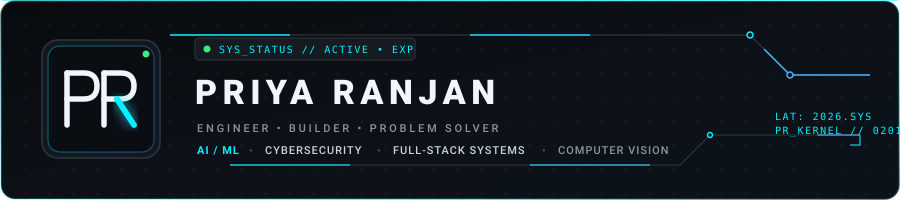
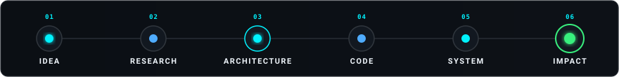
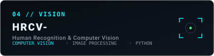
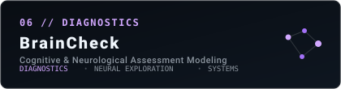
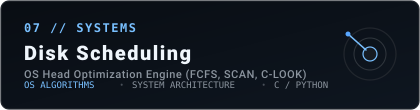
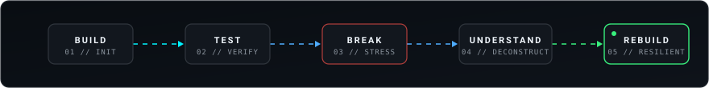

<div align="center">

<!-- HERO BANNER -->
<a href="https://github.com/Priya-Ranjan-0201">
  
</a>

<br/><br/>

<!-- TYPING ANIMATION (readme-typing-svg) -->
<a href="https://github.com/Priya-Ranjan-0201">
  
</a>

<br/>

<!-- ACTION / SOCIAL ANCHORS -->
<p align="center">
  <a href="https://github.com/Priya-Ranjan-0201">
    
  </a>
  &nbsp;
  <a href="https://github.com/Priya-Ranjan-0201">
    
  </a>
  &nbsp;
  <a href="https://www.linkedin.com/in/priyaranjan01/">
    
  </a>
  &nbsp;
  <a href="mailto:priye0201@gmail.com">
    
  </a>
</p>

</div>

---

### 01 // IDENTITY

```
WHO_I_AM:
├─ Name:         Priya Ranjan
├─ Discipline:   Computer Science & Engineering
├─ Core Mindset: Problem-first engineering over tech-stack chasing
├─ Focus Areas:  Artificial Intelligence • Cybersecurity • Full-Stack Systems
└─ Philosophy:   "Ideas → Systems → Code → Impact"
```

I am a Computer Science & Engineering student driven by a desire to build software that solves tangible, practical problems. Rather than viewing engineering as isolated lines of syntax, I approach development as an end-to-end discipline: moving methodically from **problem discovery**, to **deep research**, to **system architecture**, and finally to **resilient code**.

My day-to-day focus centers on exploring machine learning applications, dissecting security and digital trust protocols, and engineering clean, interactive web systems.

> *"I care more about solving the right problem than using the newest technology."*

---

### 02 // SYSTEM PIPELINE

<div align="center">
  
</div>

---

### 03 // CURRENTLY BUILDING

High-focus, active development initiatives where core system architectures are being implemented and refined:

<table>
<tr>
<td width="50%" valign="top">

#### 🚀 [VIREONIQ](https://github.com/Priya-Ranjan-0201/VIREONIQ)
**AI-Powered Career Intelligence Platform**

- **Why It Exists:** Navigating career transitions and skill-market alignment is noisy, opaque, and inefficient. VIREONIQ explores intelligent parsing and contextual data modeling to deliver actionable career direction.
- **What I Am Exploring:** NLP pipelines, full-stack application architecture, intelligent recommendation logic, and clean UI workflows.
- **Status:** Active development & structural iteration.

<br/>

👉 **[Inspect Repository →](https://github.com/Priya-Ranjan-0201/VIREONIQ)**

</td>
<td width="50%" valign="top">

#### 🛡️ [TrustShield-X](https://github.com/Priya-Ranjan-0201/TrustShield-X)
**Digital Trust & Cyber Defense Architecture**

- **Why It Exists:** Systems are increasingly susceptible to spoofing, credential compromise, and untrusted vectors. TrustShield-X investigates systematic trust verification and threat defense mechanisms.
- **What I Am Exploring:** Security design patterns, threat surface mitigation, defensive validation logic, and resilient backend rules.
- **Status:** Prototyping core validation models.

<br/>

👉 **[Inspect Repository →](https://github.com/Priya-Ranjan-0201/TrustShield-X)**

</td>
</tr>
</table>

---

### 04 // SELECTED WORK

A curated index of public projects, system simulations, and technical explorations:

<table width="100%">
<tr>
<td width="50%" valign="top">

<a href="https://github.com/Priya-Ranjan-0201/VIREONIQ">
  
</a>

**01 / VIREONIQ**  
AI-driven platform designed for career intelligence, skill mapping, and guided trajectory analysis.  
`Focus: AI/ML • Full-Stack • NLP`  
🔗 **[View Repository](https://github.com/Priya-Ranjan-0201/VIREONIQ)**

</td>
<td width="50%" valign="top">

<a href="https://github.com/Priya-Ranjan-0201/TrustShield-X">
  
</a>

**02 / TrustShield-X**  
Security framework examining defensive software paradigms, trust scoring, and anomaly awareness.  
`Focus: Cybersecurity • Threat Modeling • Systems`  
🔗 **[View Repository](https://github.com/Priya-Ranjan-0201/TrustShield-X)**

</td>
</tr>
<tr>
<td width="50%" valign="top">

<a href="https://github.com/Priya-Ranjan-0201/TECH-ON-TOUR">
  
</a>

**03 / TECH-ON-TOUR**  
A full-stack web platform built to demonstrate responsive interface architectures and dynamic user journeys.  
`Focus: Full-Stack Web • UI/UX • Modern Architecture`  
🔗 **[View Repository](https://github.com/Priya-Ranjan-0201/TECH-ON-TOUR)**

</td>
<td width="50%" valign="top">

<a href="https://github.com/Priya-Ranjan-0201/HRCV-">
  
</a>

**04 / HRCV-**  
Computer vision repository exploring human recognition, feature tracking, and image-based inference.  
`Focus: Computer Vision • OpenCV • Python`  
🔗 **[View Repository](https://github.com/Priya-Ranjan-0201/HRCV-)**

</td>
</tr>
<tr>
<td width="50%" valign="top">

<a href="https://github.com/Priya-Ranjan-0201/Priocardix-AI">
  
</a>

**05 / Priocardix-AI**  
Predictive modeling project exploring machine learning applications in cardiac assessment and health markers.  
`Focus: Healthcare AI • Predictive Modeling • Data Analysis`  
🔗 **[View Repository](https://github.com/Priya-Ranjan-0201/Priocardix-AI)**

</td>
<td width="50%" valign="top">

<a href="https://github.com/Priya-Ranjan-0201/BrainCheck">
  
</a>

**06 / BrainCheck**  
Exploratory diagnostic project analyzing cognitive benchmarks, pattern evaluation, and data pipelines.  
`Focus: Diagnostics Exploration • ML • Systems`  
🔗 **[View Repository](https://github.com/Priya-Ranjan-0201/BrainCheck)**

</td>
</tr>
<tr>
<td colspan="2" valign="top">

<a href="https://github.com/Priya-Ranjan-0201/Disk_Scheduling_Algorithm">
  
</a>

**07 / Disk_Scheduling_Algorithm**  
Operating systems simulator implementing and benchmarking classical disk arm scheduling algorithms (FCFS, SSTF, SCAN, C-SCAN, LOOK, C-LOOK) to minimize seek latency and head travel.  
`Focus: Operating Systems • Algorithm Optimization • C / Python`  
🔗 **[View Repository](https://github.com/Priya-Ranjan-0201/Disk_Scheduling_Algorithm)**

</td>
</tr>
</table>

---

### 05 // ENGINEERING STACK

Grounded in practical usage—no inflated percentages or artificial skill bars:

```
[PRIMARY LANGUAGES]
 Python                     JavaScript                 C                          HTML5 / CSS3

[WEB & SYSTEMS]
 React                      Node.js                    Django                     RESTful APIs

[CORE TOOLING & WORKFLOW]
 Git                        GitHub                     Linux / Bash               VS Code

[ACTIVE EXPLORATION & RESEARCH]
 Machine Learning / AI      Computer Vision (CV)       Cybersecurity Protocols    Interactive Web UI
```

---

### 06 // HOW I THINK

An engineering framework derived from iterative problem-solving:

```
01 // FIND THE REAL PROBLEM      Never solve a symptom when the core bottleneck remains untouched.
02 // UNDERSTAND THE SYSTEM      Map dependencies, data flow, and failure states before writing code.
03 // BUILD THE SMALLEST VERSION Test hypothesis with a minimal, functioning prototype first.
04 // TEST ASSUMPTIONS           Stress test corner cases and measure actual behavior against theory.
05 // IMPROVE WHAT MATTERS       Optimize algorithms and architectures only where it adds real value.
06 // KEEP LEARNING              Treat every broken build as system feedback, not failure.
```

---

### 07 // THE LAB

*The Lab* represents my sandbox of active research, technical experiments, and continuous learning:

- 🧠 **AI & ML Exploration:** Experimenting with feature extraction, data classification pipelines, and evaluating lightweight models for edge or web deployment.
- 🛡️ **Cybersecurity Heuristics:** Analyzing common security vulnerabilities, input sanitization routines, and defensive authentication flows.
- 👁️ **Computer Vision Experiments:** Prototyping contour detection, facial landmark recognition, and motion tracking using Python.
- 🌐 **Creative & Interactive Web:** Exploring performant DOM manipulations, glassmorphism, responsive micro-interactions, and 3D web fundamentals.
- ⚙️ **Systems & Optimization:** Studying OS scheduling mechanics, memory management fundamentals, and algorithm efficiency tradeoffs.

<div align="center">
  
</div>

---

### 08 // SYSTEM TELEMETRY & GITHUB ACTIVITY

Real-time telemetry showing live development consistency:

<div align="center">

<!-- Dual Stats & Streak Cards (Dark Mode & Cyan Accent) -->
<a href="https://github.com/Priya-Ranjan-0201">
  
</a>
&nbsp;
<a href="https://github.com/Priya-Ranjan-0201">
  
</a>

<br/><br/>

<!-- Top Languages Card -->
<a href="https://github.com/Priya-Ranjan-0201">
  
</a>

<br/><br/>

<!-- CONTRIBUTION SNAKE VISUALIZATION -->
<p align="center">
  <b>CONTRIBUTION ACTIVITY FEED</b>
</p>

<!-- Note: Generated automatically by .github/workflows/snake.yml to the 'output' branch -->
<picture>
  <source media="(prefers-color-scheme: dark)" srcset="https://raw.githubusercontent.com/Priya-Ranjan-0201/Priya-Ranjan-0201/output/github-contribution-grid-snake-dark.svg" />
  <source media="(prefers-color-scheme: light)" srcset="https://raw.githubusercontent.com/Priya-Ranjan-0201/Priya-Ranjan-0201/output/github-contribution-grid-snake.svg" />
  
</picture>

</div>

---

### 09 // CURRENT FOCUS & TIMELINE

```
NOW   ──► Deepening core architectures for VIREONIQ and TrustShield-X.
          Refining computer vision pipelines and foundational algorithmic performance.

NEXT  ──► Integrating lightweight predictive inference into web-based interfaces.
          Strengthening security threat validation heuristics.

LATER ──► Experimenting with distributed microservices and advanced creative web technologies.
```

---

### 10 // LET'S CONNECT

Whether you want to discuss system architectures, collaborate on an open-source tool, or exchange ideas around AI and security, feel free to reach out:

<div align="left">

- 🌐 **Portfolio:** *Interactive 3D Experience — In Active Development*
- 💼 **LinkedIn:** [linkedin.com/in/priyaranjan01](https://www.linkedin.com/in/priyaranjan01/)
- ✉️ **Direct Email:** [priye0201@gmail.com](mailto:priye0201@gmail.com)
- 🐙 **GitHub:** [github.com/Priya-Ranjan-0201](https://github.com/Priya-Ranjan-0201)

</div>

<!-- EASTER EGG: System Heartbeat -->
<!-- [SYSTEM HEARTBEAT: OK // KERNEL 0201 // LATENCY 0ms // TURN IDEAS INTO IMPACT] -->

<br/>

---

<div align="center">

<p align="center">
  
</p>

```
PR // TURN IDEAS INTO IMPACT.
```
<sub>Designed &amp; Maintained with care by **Priya Ranjan** • Built for real engineering</sub>

</div>
