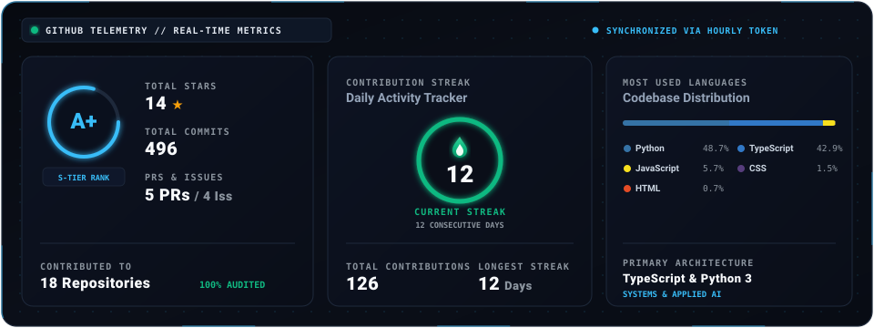
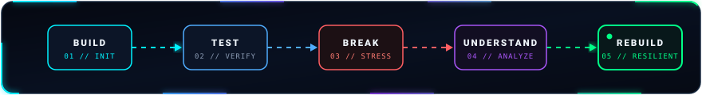
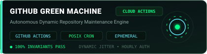
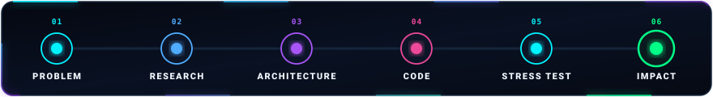

<div align="center">

<!-- HERO BANNER -->
<a href="https://github.com/Priya-Ranjan-0201">
  
</a>

<br/><br/>

<!-- ANIMATED TYPEWRITER SUBTITLE (URL-ENCODED TO PREVENT TRUNCATION) -->
<a href="https://github.com/Priya-Ranjan-0201">
  
</a>

<br/>

<!-- CLEAN MINIMALIST NAVIGATION PILLS -->
<p align="center">
  <a href="https://github.com/Priya-Ranjan-0201">
    
  </a>
  &nbsp;
  <a href="https://github.com/Priya-Ranjan-0201/Priya-Ranjan-0201/tree/main/portfolio">
    
  </a>
  &nbsp;
  <a href="https://linkedin.com/in/priye-ranjan">
    
  </a>
  &nbsp;
  <a href="mailto:priye0201@gmail.com">
    
  </a>
</p>

<!-- REAL-TIME STATUS PILL -->
<p align="center">
  
  &nbsp;
  
  &nbsp;
  
</p>

</div>

---

## 👨‍💻 About The Architect

```bash
priya-ranjan@station:~$ whoami --verbose
```

> I am a **Computer Science & Engineering undergraduate (B.Tech 2023–2027)** driven by a passion for understanding computing from first principles. Rather than treating computers as black boxes, I care about what happens in the milliseconds between hardware instructions, operating system scheduling, network socket packets, and user interfaces.

### 🎯 Core Engineering Vectors:
- **Low-Level Systems & OS Kinematics**: Process scheduling, disk arm seek kinematics, memory layout, and Linux POSIX internals.
- **Defensive Cybersecurity & Networks**: Asynchronous socket concurrency, port vulnerability inspection, cryptographic audit logging (SHA-256), and STIX 2.1 threat modeling.
- **Intelligent Applications & AI**: Abstract Syntax Tree (AST) static code analysis, semantic vector retrieval with Qdrant, and explainable AI with TreeSHAP.
- **Full-Stack Systems Architecture**: Building resilient backends (FastAPI, AsyncIO, Flask) and responsive clients (React, Next.js, HTML5 Canvas) verified by automated test suites.
- 🏆 **Smart India Hackathon (SIH) Grand Finalist**: Architected India's Digital Public Infrastructure for Smart Tourism (*TECH-ON-TOUR / TravelSathi*), implementing multilingual itinerary generation, anti-overtourism gatekeeping, and geospatial search graphs.

---

## ⚡ GitHub Telemetry & Verified Engineering Stats

<div align="center">

<!-- LIVE ACCURATE TELEMETRY DASHBOARD (SYNCHRONIZED DAILY VIA HOURLY GITHUB_TOKEN) -->
<a href="https://github.com/Priya-Ranjan-0201">
  
</a>

<br/><br/>

<!-- CONTRIBUTION ACTIVITY GRID SNAKE -->
<p align="center">
  <b>🟩 CONTRIBUTION ACTIVITY FEED</b>
</p>

<picture>
  <source media="(prefers-color-scheme: dark)" srcset="https://raw.githubusercontent.com/Priya-Ranjan-0201/Priya-Ranjan-0201/output/github-contribution-grid-snake-dark.svg" />
  <source media="(prefers-color-scheme: light)" srcset="https://raw.githubusercontent.com/Priya-Ranjan-0201/Priya-Ranjan-0201/output/github-contribution-grid-snake.svg" />
  
</picture>

</div>

---

## 🛠️ Technical Arsenal & Core Stack

<div align="center">

### 💻 Core Systems & Programming Languages
<p align="center">
  
  &nbsp;
  
  &nbsp;
  
  &nbsp;
  
  &nbsp;
  
  &nbsp;
  
</p>

### 🧠 AI, Vector Engines & Code Analysis
<p align="center">
  
  &nbsp;
  
  &nbsp;
  
  &nbsp;
  
  &nbsp;
  
</p>

### ⚡ Backend, Concurrency & Networking
<p align="center">
  
  &nbsp;
  
  &nbsp;
  
  &nbsp;
  
  &nbsp;
  
  &nbsp;
  
</p>

### 🎨 Frontend & Interface Engineering
<p align="center">
  
  &nbsp;
  
  &nbsp;
  
  &nbsp;
  
  &nbsp;
  
</p>

### 🛡️ DevOps, Security & Infrastructure
<p align="center">
  
  &nbsp;
  
  &nbsp;
  
  &nbsp;
  
  &nbsp;
  
</p>

</div>

<br/>

<div align="center">
  
</div>

---

## 🚀 Flagship Engineering Projects

A curated portfolio of open-source repositories, system kinematics simulations, and production prototypes:

<br/>

### 1. [VIREONIQ](https://github.com/Priya-Ranjan-0201/VIREONIQ) — Developer Career Roadmap & AST Code Analysis Engine
<a href="https://github.com/Priya-Ranjan-0201/VIREONIQ">
  
</a>

- **Core Problem:** Hiring platforms rely on superficial keyword matching, rewarding buzzword stuffing rather than verified structural coding ability.
- **Architecture & Innovation:** Parses submitted source code using Python Abstract Syntax Trees (AST) to measure structural complexity without execution vulnerability. Pairs insights with Qdrant vector embeddings to build prerequisite learning roadmaps.
- **Engineering Status:** Validated with **153/153 passing automated test suites** across FastAPI endpoints, AST visitors, and vector searches.
- **Tech Stack:** `Python 3.11` • `FastAPI` • `React 18` • `Qdrant Vector DB` • `PostgreSQL` • `Docker Compose`
- 🔗 **[Explore Repository →](https://github.com/Priya-Ranjan-0201/VIREONIQ)**

<br/>

### 2. [TrustShield-X](https://github.com/Priya-Ranjan-0201/TrustShield-X) — High-Speed Concurrent Network & Threat Intelligence Engine
<a href="https://github.com/Priya-Ranjan-0201/TrustShield-X">
  
</a>

- **Core Problem:** Web and internal services are frequently exposed to misconfigured headers, unpatched ports, and weak TLS handshakes.
- **Architecture & Innovation:** Built on Python 3.13 AsyncIO with bounded semaphore connection pools for sub-15ms multi-vector socket inspection, HTTP security header auditing, and SHA-256 tamper-evident cryptographic audit trails.
- **Engineering Status:** Enforces defensive security invariants with STIX 2.1 threat modeling integration.
- **Tech Stack:** `Python 3.13 AsyncIO` • `Raw Sockets` • `STIX 2.1` • `SHA-256 Audit Logs` • `Defensive Security`
- 🔗 **[Explore Repository →](https://github.com/Priya-Ranjan-0201/TrustShield-X)**

<br/>

### 3. [TECH-ON-TOUR (TravelSathi)](https://github.com/Priya-Ranjan-0201/TECH-ON-TOUR) — Digital Public Infrastructure for Smart Tourism
<a href="https://github.com/Priya-Ranjan-0201/TECH-ON-TOUR">
  
</a>

- **Core Problem:** Popular tourist corridors face unmanaged overcrowding, lack of regional language assistance, and fragmented transit routing.
- **Architecture & Innovation:** Built for the **Smart India Hackathon Grand Finale**. Combines GeoJSON 2dsphere indexing, anti-overtourism gatekeeping algorithms, and a regional destination search graph.
- **Engineering Status:** SIH Grand Finale platform with multilingual itinerary generation and map clustering.
- **Tech Stack:** `FastAPI` • `React` • `Python` • `MongoDB (2dsphere)` • `Leaflet` • `Search Graphs`
- 🔗 **[Explore Repository →](https://github.com/Priya-Ranjan-0201/TECH-ON-TOUR)**

<br/>

### 4. [Disk Scheduling Algorithm](https://github.com/Priya-Ranjan-0201/Disk_Scheduling_Algorithm) — OS Storage Kinematics Simulator
<a href="https://github.com/Priya-Ranjan-0201/Disk_Scheduling_Algorithm">
  
</a>

- **Core Problem:** Visualizing and benchmarking seek latency tradeoffs between classical disk arm scheduling algorithms is difficult using static textbooks.
- **Architecture & Innovation:** Implements and benchmarks 11 classical disk arm scheduling algorithms (FCFS, SSTF, SCAN, C-SCAN, LOOK, C-LOOK) paired with real-time 60 FPS HTML5 Canvas physical arm seek kinematics.
- **Engineering Status:** Interactive OS simulator benchmark suite comparing head movements and turnaround times.
- **Tech Stack:** `JavaScript (ES6+)` • `HTML5 Canvas API` • `OS Storage Kinematics` • `Algorithms`
- 🔗 **[Explore Repository →](https://github.com/Priya-Ranjan-0201/Disk_Scheduling_Algorithm)**

<br/>

### 5. [Priocardix-AI](https://github.com/Priya-Ranjan-0201/Priocardix-AI) — Preventive Cardiovascular Risk Assessment
<a href="https://github.com/Priya-Ranjan-0201/Priocardix-AI">
  
</a>

- **Core Problem:** Clinical machine learning risk models are often opaque "black boxes" that clinicians hesitate to trust without attribution.
- **Architecture & Innovation:** Enterprise preventive cardiology platform featuring explainable risk modeling powered by TreeSHAP attribution and dynamic interactive risk simulation sliders.
- **Tech Stack:** `React` • `Machine Learning` • `TreeSHAP` • `Zustand` • `Clinical AI`
- 🔗 **[Explore Repository →](https://github.com/Priya-Ranjan-0201/Priocardix-AI)**

<br/>

### 6. [GitHub Green Machine](https://github.com/Priya-Ranjan-0201/github-green-machine) — Autonomous Cloud Maintenance Engine
<a href="https://github.com/Priya-Ranjan-0201/github-green-machine">
  
</a>

- **Core Problem:** Maintaining continuous repository telemetry and legitimate forward-moving git activity across repositories without manual daily chores.
- **Architecture & Innovation:** Autonomous, scheduled GitHub Actions engine with an organic dynamic decision engine, random jitter, and built-in ephemeral hourly `GITHUB_TOKEN` security.
- **Tech Stack:** `GitHub Actions` • `POSIX Cron` • `Bash` • `Git Telemetry` • `Cloud Automation`
- 🔗 **[Explore Repository →](https://github.com/Priya-Ranjan-0201/github-green-machine)**

---

## ⚙️ Engineering Principles

<div align="center">
  
</div>

<br/>

- **First-Principles Architecture**: Understand the underlying hardware constraint, network protocol, or data structure before reaching for a complex dependency.
- **Resilience Under Load**: Bounded concurrency pools, explicit timeouts, and defensive invariants make software dependable when pushed to its limits.
- **Clarity Over Cleverness**: Code is read far more often than it is written. Clean types, intuitive interfaces, and modular structures outlive clever shortcuts.
- **Telemetry-Driven Decisions**: Profile memory, measure execution latency, and verify behavior with automated test suites—never optimize through guesswork.

---

## 📬 Let's Connect & Collaborate

Whether you're interested in systems engineering, defensive cybersecurity, full-stack applications, or exploring collaboration opportunities:

<div align="center">

<p align="center">
  <a href="https://linkedin.com/in/priye-ranjan">
    
  </a>
  &nbsp;
  <a href="https://github.com/Priya-Ranjan-0201">
    
  </a>
  &nbsp;
  <a href="mailto:priye0201@gmail.com">
    
  </a>
  &nbsp;
  <a href="https://github.com/Priya-Ranjan-0201/Priya-Ranjan-0201/tree/main/portfolio">
    
  </a>
</p>

<br/>

<sub>Crafted with precision &amp; care by **Priya Ranjan** • Built for real engineering</sub>

</div>
