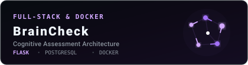

<!-- HERO BANNER -->

  

<!-- RESPONSIVE TYPING SVG -->

 

<!-- ACTION / SOCIAL ANCHORS -->

  
  &nbsp;
  
  &nbsp;
  
  &nbsp;
  

---

## 👨‍💻 About Me

I am a **Computer Science & Engineering undergraduate (B.Tech 2023–2027)** with a deep passion for understanding computing from first principles. Rather than treating computers as black boxes, I care about what happens in the milliseconds between hardware instructions, operating system scheduling, network socket packets, and user interfaces.

My engineering work sits at the convergence of:
- **Low-Level Systems & OS**: Process scheduling, disk arm kinematics, memory layout, and Linux internals.
- **Defensive Cybersecurity & Networks**: Asynchronous socket concurrency, port vulnerability inspection, cryptographic logging (SHA-256), and threat modeling.
- **Intelligent Applications & AI**: Abstract Syntax Tree (AST) static code analysis, semantic vector retrieval with Qdrant, and explainable machine learning.
- **Full-Stack Systems Architecture**: Building resilient backends (FastAPI, Flask) and responsive clients (React, Next.js) backed by automated test suites.

> 🏆 **Smart India Hackathon (SIH) Grand Finalist**: Architected India's Digital Public Infrastructure for Smart Tourism (*TECH-ON-TOUR / TravelSathi*), implementing multilingual assistance, anti-overtourism gatekeeping, and geospatial search graphs.

---

## 🛠️ Technical Arsenal

| Domain | Technologies &amp; Tools |
| :--- | :--- |
| **Languages** | `Python (3.11/3.13)` • `C (Systems & OS)` • `TypeScript` • `JavaScript (ES6+)` • `SQL` • `HTML5 / CSS3` |
| **Backend &amp; APIs** | `FastAPI` • `Flask Blueprints` • `Next.js` • `AsyncIO Sockets` • `RESTful Services` |
| **Frontend &amp; UI** | `React 18 / 19` • `Next.js (App Router)` • `HTML5 Canvas` • `Zustand` • `Tailwind CSS` |
| **Databases &amp; Stores** | `PostgreSQL` • `Qdrant (Vector DB)` • `Redis` • `MongoDB (2dsphere GeoJSON)` |
| **Systems &amp; DevOps** | `Linux / Bash` • `Docker & Docker Compose` • `Git & GitHub Actions` • `Nginx` • `WSL2` |
| **Specialized Focus** | `Abstract Syntax Trees (AST)` • `Defensive Security` • `Computer Vision (OpenCV)` • `OS Kinematics` |

 

  

---

## 🚀 Featured Engineering Projects

A curated selection of flagship open-source repositories, system simulations, and production prototypes:

 

### 1. [VIREONIQ](https://github.com/Priya-Ranjan-0201/VIREONIQ) — Developer Career Roadmap & AST Code Analysis Engine

- **Core Problem:** Hiring platforms rely on superficial keyword matching, rewarding buzzword stuffing rather than verified structural coding ability.
- **Architecture & Innovation:** Parses submitted source code using Python Abstract Syntax Trees (AST) to measure structural complexity without execution vulnerability. Pairs insights with Qdrant vector embeddings to build prerequisite learning roadmaps.
- **Engineering Status:** Validated with **153/153 passing automated test suites** across FastAPI endpoints, AST visitors, and vector searches.
- **Tech Stack:** `Python 3.11` • `FastAPI` • `React 18` • `Qdrant Vector DB` • `PostgreSQL` • `Docker Compose`
- 🔗 **[Explore Repository →](https://github.com/Priya-Ranjan-0201/VIREONIQ)**

 

### 2. [TrustShield-X](https://github.com/Priya-Ranjan-0201/TrustShield-X) — High-Speed Concurrent Network & Threat Intelligence Engine

- **Core Problem:** Web and internal services are frequently exposed to misconfigured headers, unpatched ports, and weak TLS handshakes.
- **Architecture & Innovation:** Built on Python 3.13 AsyncIO with bounded semaphore connection pools for sub-15ms multi-vector socket inspection, HTTP security header auditing, and SHA-256 tamper-evident cryptographic audit trails.
- **Engineering Status:** Enforces defensive security invariants with STIX 2.1 threat modeling integration.
- **Tech Stack:** `Python 3.13 AsyncIO` • `Raw Sockets` • `STIX 2.1` • `SHA-256 Audit Logs` • `Defensive Security`
- 🔗 **[Explore Repository →](https://github.com/Priya-Ranjan-0201/TrustShield-X)**

 

### 3. [TECH-ON-TOUR (TravelSathi)](https://github.com/Priya-Ranjan-0201/TECH-ON-TOUR) — Digital Public Infrastructure for Smart Tourism

- **Core Problem:** Popular tourist corridors face unmanaged overcrowding, lack of regional language assistance, and fragmented transit routing.
- **Architecture & Innovation:** Built for the **Smart India Hackathon Grand Finale**. Combines GeoJSON 2dsphere indexing, anti-overtourism gatekeeping algorithms, and a regional destination search graph.
- **Engineering Status:** SIH Grand Finale platform with multilingual itinerary generation and map clustering.
- **Tech Stack:** `FastAPI` • `React` • `Python` • `MongoDB (2dsphere)` • `Leaflet` • `Search Graphs`
- 🔗 **[Explore Repository →](https://github.com/Priya-Ranjan-0201/TECH-ON-TOUR)**

 

### 4. [Disk Scheduling Algorithm](https://github.com/Priya-Ranjan-0201/Disk_Scheduling_Algorithm) — OS Storage Kinematics Simulator

- **Core Problem:** Visualizing and benchmarking seek latency tradeoffs between classical disk arm scheduling algorithms is difficult using static textbooks.
- **Architecture & Innovation:** Implements and benchmarks 11 classical disk arm scheduling algorithms (FCFS, SSTF, SCAN, C-SCAN, LOOK, C-LOOK) paired with real-time 60 FPS HTML5 Canvas physical arm seek kinematics.
- **Engineering Status:** Interactive OS simulator benchmark suite comparing head movements and turnaround times.
- **Tech Stack:** `JavaScript (ES6+)` • `HTML5 Canvas API` • `OS Storage Kinematics` • `Algorithms`
- 🔗 **[Explore Repository →](https://github.com/Priya-Ranjan-0201/Disk_Scheduling_Algorithm)**

 

### 5. [Priocardix-AI](https://github.com/Priya-Ranjan-0201/Priocardix-AI) — Preventive Cardiovascular Risk Assessment

- **Core Problem:** Clinical machine learning risk models are often opaque "black boxes" that clinicians hesitate to trust without attribution.
- **Architecture & Innovation:** Enterprise preventive cardiology platform featuring explainable risk modeling powered by TreeSHAP attribution and dynamic interactive risk simulation sliders.
- **Tech Stack:** `React` • `Machine Learning` • `TreeSHAP` • `Zustand` • `Clinical AI`
- 🔗 **[Explore Repository →](https://github.com/Priya-Ranjan-0201/Priocardix-AI)**

 

### 6. [BrainCheck](https://github.com/Priya-Ranjan-0201/BrainCheck) — Cognitive Assessment & Assessment Platform

- **Core Problem:** Complex assessment systems often tangle business logic, leading to fragile monolithic backends.
- **Architecture & Innovation:** Modular cognitive assessment application engineered with decoupled Flask Blueprints, relational PostgreSQL schemas, and Docker containerization.
- **Tech Stack:** `Python` • `Flask Blueprints` • `PostgreSQL` • `Docker Compose`
- 🔗 **[Explore Repository →](https://github.com/Priya-Ranjan-0201/BrainCheck)**

 

### 7. [HRCV-](https://github.com/Priya-Ranjan-0201/HRCV-) — Real-Time Visual Feature Detection Pipeline

- **Core Problem:** High latency and unstable frame rates in lightweight computer vision feature detection pipelines.
- **Architecture & Innovation:** Computer vision pipeline applying matrix operations with NumPy and OpenCV for stable, low-latency visual feature tracking and interaction states.
- **Tech Stack:** `Python` • `OpenCV` • `NumPy` • `Image Processing`
- 🔗 **[Explore Repository →](https://github.com/Priya-Ranjan-0201/HRCV-)**

---

## ⚙️ Engineering Principles

  

 

- **First-Principles Architecture**: Understand the underlying hardware constraint, network protocol, or data structure before reaching for a complex dependency.
- **Resilience Under Load**: Bounded concurrency pools, explicit timeouts, and defensive invariants make software dependable when pushed to its limits.
- **Clarity Over Cleverness**: Code is read far more often than it is written. Clean types, intuitive interfaces, and modular structures outlive clever shortcuts.
- **Telemetry-Driven Decisions**: Profile memory, measure execution latency, and verify behavior with automated test suites—never optimize through guesswork.

---

## 📊 GitHub Telemetry & Stats

&nbsp;

  

  

  <b>CONTRIBUTION ACTIVITY</b>

<picture>
  <source media="(prefers-color-scheme: dark)" srcset="https://raw.githubusercontent.com/Priya-Ranjan-0201/Priya-Ranjan-0201/output/github-contribution-grid-snake-dark.svg" />
  <source media="(prefers-color-scheme: light)" srcset="https://raw.githubusercontent.com/Priya-Ranjan-0201/Priya-Ranjan-0201/output/github-contribution-grid-snake.svg" />
  
</picture>

---

## 📬 Let's Connect & Collaborate

Whether you're interested in systems engineering, defensive security, full-stack applications, or exploring collaboration opportunities:

&nbsp;

&nbsp;

&nbsp;

 

Crafted with precision &amp; care by **Priya Ranjan** • Built for real engineering

