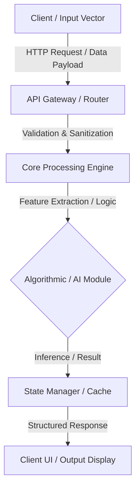

# [PROJECT NAME]

<div align="center">

<!-- Optional Project Banner / Title Graphic -->
<!--  -->

### [One-line punchy, technical description of the project]

[](https://github.com/Priya-Ranjan-0201)
[](LICENSE)
[](https://github.com/Priya-Ranjan-0201)

[Explore Documentation](#-architecture) • [Quick Start](#-how-to-run) • [Report Issue](https://github.com/Priya-Ranjan-0201/[PROJECT_NAME]/issues)

</div>

---

## 📌 Problem Statement

*What problem does this project address? Why does it exist?*

- **The Core Challenge:** [Describe the specific bottleneck, manual inefficiency, security flaw, or algorithmic difficulty.]
- **Why Existing Solutions Fall Short:** [Explain why trivial or standard approaches are inadequate.]
- **Target Audience & Scope:** [Clarify who this is for and what problem boundary it focuses on.]

---

## 💡 The Solution

*How does this project solve the problem from an engineering perspective?*

[Provide 1–2 paragraphs explaining your technical methodology, how data is parsed or processed, and how the system delivers its output. Focus on system architecture and design decisions rather than generic buzzwords.]

---

## ⚡ Key Features

- **[Feature 1]:** [Brief description of what it does, highlighting efficiency, modularity, or user experience.]
- **[Feature 2]:** [Brief description of the pipeline, data flow, or background handling.]
- **[Feature 3]:** [Description of defensive validation, error boundaries, or responsive UI logic.]
- **[Feature 4]:** [Extensibility, API interoperability, or algorithm benchmarking.]

---

## 🏗️ Architecture & Data Flow



### Component Breakdown
1. **Input Interface:** [How data enters the application: CLI, REST endpoint, web client, or camera stream].
2. **Processing Layer:** [How logic or preprocessing is executed].
3. **Core Model / Algorithm:** [The decision logic, ML model, or security validator].
4. **Output / Persistence:** [How results are rendered, formatted, or stored].

---

## 🛠️ Technology Stack

| Layer | Technologies | Purpose |
| :--- | :--- | :--- |
| **Language** | Python / JavaScript / C | Core system implementation |
| **Frontend / UI** | React / HTML5 / CSS3 | Responsive client experience |
| **Backend / API** | Node.js / Django | Route management & business logic |
| **Data / Algorithms** | NumPy / OpenCV / Heuristics | Computation & data manipulation |
| **Version Control** | Git / GitHub | Code management & CI workflows |

---

## 📸 Demonstration & Visuals

<!-- If screenshots exist, place them here. Avoid fabricated or placeholder UI graphics. -->

| View | Description |
| :--- | :--- |
| **Primary Dashboard / Execution** |  |
| **Results / Terminal Output** |  |

---

## 🚀 How to Run

### Prerequisites
- [Language / Runtime Version, e.g., `Python 3.10+` or `Node.js 18+`]
- [Package Manager, e.g., `pip` or `npm`]
- [Git installed]

### 1. Clone Repository
```bash
git clone https://github.com/Priya-Ranjan-0201/[PROJECT_NAME].git
cd [PROJECT_NAME]
```

### 2. Configure Environment (if applicable)
```bash
cp .env.example .env
# Edit .env with your specific configuration
```

### 3. Install Dependencies
```bash
# For Python:
python -m venv venv
source venv/bin/activate  # On Windows: venv\Scripts\activate
pip install -r requirements.txt

# For Node.js:
npm install
```

### 4. Execute / Launch
```bash
# For Python application:
python main.py

# For Web application:
npm run dev
```

---

## 📂 Project Structure

```text
[PROJECT_NAME]/
├── assets/                 # Images, architecture diagrams, and static media
├── src/                    # Source code directory
│   ├── components/         # Reusable modules or UI elements
│   ├── core/               # Main algorithmic engine or business logic
│   └── utils/              # Helper functions and validators
├── tests/                  # Unit and integration test suites
├── .gitignore              # Ignored build and cache files
├── requirements.txt        # Python package manifests (or package.json)
├── README.md               # Project documentation
└── LICENSE                 # Open source license
```

---

## 🧩 Engineering Challenges & Lessons Learned

- **Challenge 1:** [Describe a real architectural or performance challenge encountered during development.]
  - *Resolution:* [How you diagnosed, debugged, and solved the issue.]
- **Challenge 2:** [Describe edge cases or data handling constraints.]
  - *Resolution:* [How defensive programming or fallback logic resolved it.]

---

## 🗺️ Roadmap

- [x] Core algorithmic prototype & functional baseline
- [x] Input parsing and validation logic
- [ ] Integration of asynchronous background tasks
- [ ] Comprehensive unit test suite with 80%+ coverage
- [ ] Performance benchmarking under scaled payloads

---

## 🤝 Contributing

Contributions, issues, and feature requests are welcome!

1. Fork the repository (`https://github.com/Priya-Ranjan-0201/[PROJECT_NAME]/fork`)
2. Create your feature branch (`git checkout -b feature/Optimization`)
3. Commit your changes (`git commit -m 'feat: implement optimized data indexing'`)
4. Push to the branch (`git push origin feature/Optimization`)
5. Open a Pull Request

---

## 📜 License

Distributed under the MIT License. See [`LICENSE`](LICENSE) for more details.

---

<div align="center">

Developed by **[Priya Ranjan](https://github.com/Priya-Ranjan-0201)**  
*Building at the intersection of AI, cybersecurity, and software systems.*

</div>
