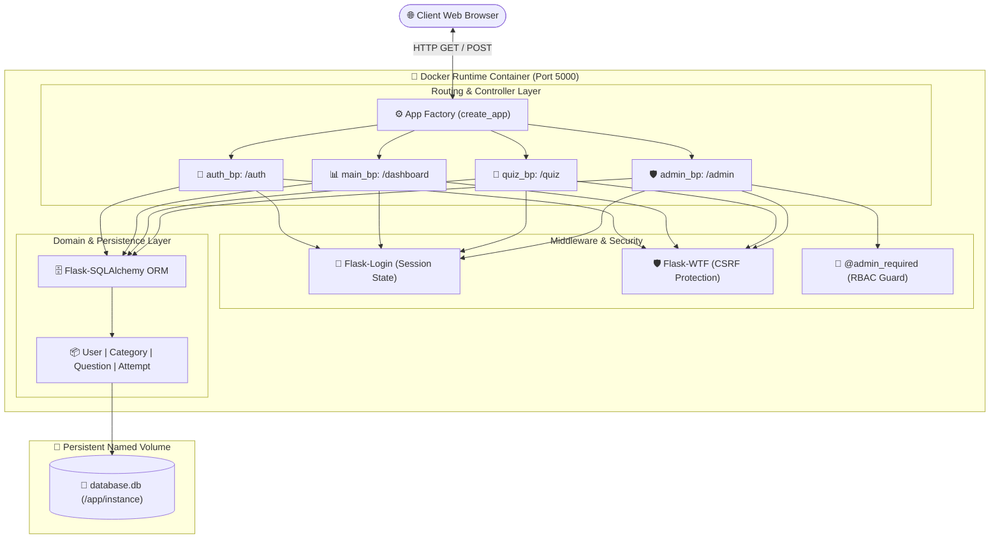
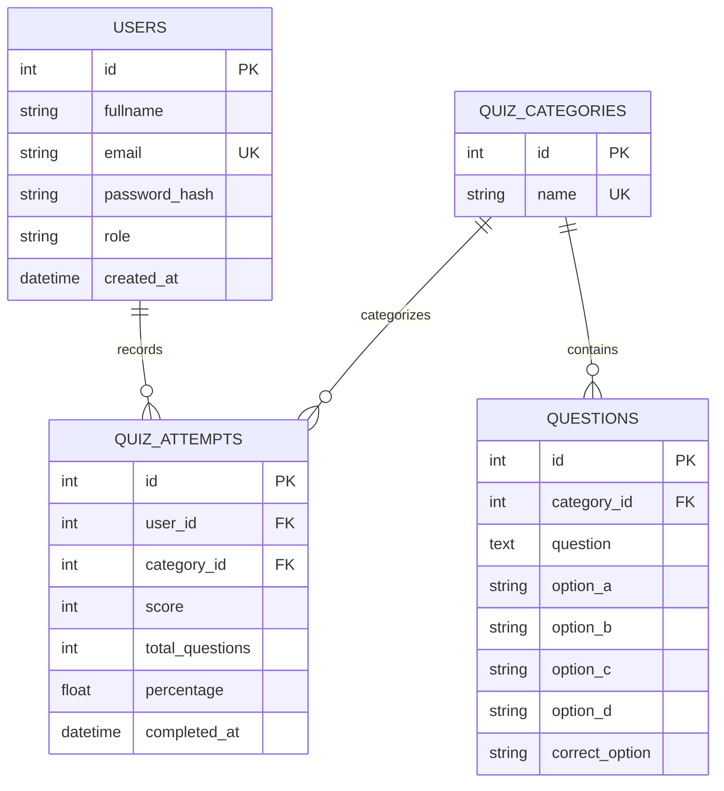
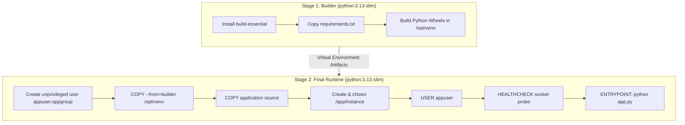
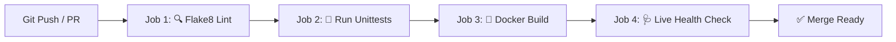

<div align="center">

# 🧠 BrainCheck — Containerized MCQ Quiz Platform

### *Next-Generation Cloud-Native Assessment Platform Powered by Python, Flask, Docker & CI/CD*

[](https://python.org)
[](https://flask.palletsprojects.com/)
[](https://docker.com)
[](https://docs.docker.com/compose/)
[](https://getbootstrap.com)
[](https://sqlite.org)
[](https://github.com/Priya-Ranjan-0201/BrainCheck/actions)
[](docs/DOCKER_GUIDE.md)
[](docs/SUMMER_TRAINING_REPORT.md)
[](LICENSE)

<br/>

[🚀 **Quick Start**](#-quick-start-guide) • [✨ **Features**](#-core-features) • [🏛 **Architecture**](#-system-architecture) • [🐳 **Docker Deep Dive**](#-docker-architecture--multi-stage-builds) • [📑 **Academic Report**](docs/SUMMER_TRAINING_REPORT.md) • [🚦 **API Routes**](docs/API_AND_ROUTES.md)

<br/>

</div>

---

## 📖 Executive Summary

**BrainCheck** is an enterprise-grade, fully containerized Multiple-Choice Question (MCQ) assessment web application engineered with modern cloud-native standards. Built using **Python 3.13** and **Flask 3.x**, the platform features a dynamic, randomized assessment engine with real-time countdown timers, interactive score progression analytics, and a comprehensive administrative portal with full CRUD controls.

The entire system is packaged inside an optimized **2-stage multi-stage Docker build**, enforcing least-privilege non-root execution (`appuser`), persistent volume storage (`braincheck_data`), and self-healing container healthchecks. It is verified through automated **GitHub Actions CI/CD workflows** covering code quality linting (Flake8), unit test suites, and live container validation.

---

## 🌟 Key Highlights at a Glance

```
┌─────────────────────────────────────────────────────────────────────────────┐
│  ⚡ Ultra-Fast Multi-Stage Docker Build (<180 MB lean runtime)             │
│  🛡️ Defense-in-Depth Security: PBKDF2 Hashing, CSRF Tokens, Non-Root UID    │
│  ⏱️ Real-Time Countdown Timer with Zero-Latency Auto-Submit Fallback        │
│  🔀 Deterministic Session Shuffling for Fair & Unbiased Testing             │
│  📊 Canvas Analytics Engine: Score progression charts & performance meters  │
│  👑 Full Admin Suite: Dynamic Categories, Question Authoring & User Audits   │
│  🔄 Self-Seeding Database: Instantly launches with pre-loaded quiz topics   │
│  🚀 Production-Ready CI/CD: Automated linting, test runner & Docker health   │
└─────────────────────────────────────────────────────────────────────────────┘
```

---

## 📑 Table of Contents

- [Executive Summary](#-executive-summary)
- [System Architecture](#-system-architecture)
- [Core Features](#-core-features)
  - [👨‍🎓 Student Assessment Portal](#-student-assessment-portal)
  - [🛡️ Administrative Control Center](#️-administrative-control-center)
  - [🔒 Security & Hardening Model](#-security--hardening-model)
  - [🐳 Cloud-Native & DevOps Standards](#-cloud-native--devops-standards)
- [Tech Stack Architecture](#-tech-stack-architecture)
- [Quick Start Guide](#-quick-start-guide)
  - [Option 1: 🐳 Docker Compose (Recommended)](#option-1--docker-compose-recommended)
  - [Option 2: 📦 Docker Direct CLI](#option-2--docker-direct-cli)
  - [Option 3: 🐍 Local Python Virtualenv](#option-3--local-python-virtualenv)
  - [Option 4: 🪟 Windows One-Click Batch Launchers](#option-4--windows-one-click-batch-launchers)
- [Default Login Credentials](#-default-login-credentials)
- [Project Directory Layout](#-project-directory-layout)
- [Database Relational Architecture](#-database-relational-architecture)
- [API & Blueprint Reference](#-api--blueprint-reference)
- [Configuration Matrix (`.env`)](#-configuration-matrix-env)
- [Docker Architecture & Multi-Stage Builds](#-docker-architecture--multi-stage-builds)
- [Continuous Integration (CI/CD) Pipeline](#-continuous-integration-cicd-pipeline)
- [Automated Testing & Quality Assurance](#-automated-testing--quality-assurance)
- [Documentation Index](#-documentation-index)
- [Academic Context & Credits](#-academic-context--credits)

---

## 🏛 System Architecture

BrainCheck implements the **Application Factory Pattern** with modular Flask **Blueprints**, cleanly separating authentication, student dashboard analytics, quiz session states, and administrative CRUD operations.



---

## ✨ Core Features

### 👨‍🎓 Student Assessment Portal
- **🔐 Secure Onboarding**: Fast registration and login powered by cryptographic password hashing (PBKDF2 SHA-256).
- **📚 Categorized Exploration**: Browse pre-seeded quiz topics (*Python, Docker, JavaScript, General Knowledge*) with live question counters.
- **🔀 Smart Shuffling Engine**: Questions are automatically shuffled into random sequences and preserved in user session state.
- **⏱️ Visual Countdown Timer**: Real-time JavaScript timer bar with automated form submission upon timeout.
- **🔁 Bidirectional Navigation**: Step forward and backward through questions with automatic radio selection memory.
- **📈 Instant Detailed Scorecard**: Immediate evaluation with overall percentage badge, correct answer highlights, and review breakdown.
- **📊 Historical Performance Analytics**: Personal dashboard tracking total quizzes attempted, average score, personal best, and past test records.

---

### 🛡️ Administrative Control Center
- **👑 Role-Based Access Control**: Strict access guard (`@admin_required`) preventing privilege escalation.
- **📊 Executive Dashboard**: System-wide metric cards for total users, admins, categories, questions, attempts, and overall platform average.
- **📁 Dynamic Category Manager**: Create, view, and safely cascade-delete quiz categories.
- **📝 Full MCQ Authoring Suite**: Create, edit, filter, and delete 4-option MCQs with dynamic category binding.
- **👥 User Audit Directory**: Real-time inspection of all registered student accounts and timestamps.
- **📜 Platform-Wide Attempt Logs**: Comprehensive history of all student submissions and scores.

---

### 🔒 Security & Hardening Model
- **🔑 Cryptographic Salting & Hashing**: Powered by Werkzeug's PBKDF2 SHA-256 hashing.
- **🛡️ CSRF Token Enforcement**: Every form submission validated with cryptographically signed tokens via `Flask-WTF`.
- **🍪 Hardened Session Cookies**: Configured with `HTTPOnly=True`, `SameSite=Lax`, and configurable `Secure=True` for HTTPS.
- **👤 Non-Root Container Sandboxing**: Runs inside Docker as dedicated unprivileged user `appuser:appgroup` (UID 10001).
- **💉 SQL Injection Immunity**: Zero raw SQL concatenation; 100% parameterized queries via SQLAlchemy ORM.

---

### 🐳 Cloud-Native & DevOps Standards
- **⚡ 2-Stage Multi-Stage Build**: Isolates build tools in stage 1; yields an ultra-lean runtime container in stage 2.
- **🚀 Layer-Caching Optimization**: Dependency layer is cached independently from application source code.
- **💾 Named Volume Durability**: Database file preserved across container destroys via `braincheck_data`.
- **🩺 Container Self-Healing**: Built-in `HEALTHCHECK` socket probe monitoring server responsiveness every 30 seconds.
- **🔄 Multi-Stage CI/CD**: GitHub Actions automating Flake8 linting, unit test execution, and live container validation.

---

## 🛠 Tech Stack Architecture

| Layer | Technology | Version | Purpose |
|---|---|---|---|
| **Language** |  | `3.13` | Core runtime and backend logic |
| **Framework** |  | `3.x` | WSGI web application routing & Blueprints |
| **ORM / DB** |   | `3.x` | Relational schema modeling & data storage |
| **Auth & Security** |   | Latest | User sessions, PBKDF2 hashing, and CSRF protection |
| **Frontend UI** |  | `5.3` | Mobile-first responsive styling and icons |
| **Charts** |  | ES6 | Interactive score progression visualization |
| **Container Engine** |  | Latest | Container runtime & multi-stage packaging |
| **Orchestrator** |  | `v2` | Service lifecycle, healthchecks, and volumes |
| **Testing** |  | Built-in | Test fixtures & route assertion framework |
| **CI/CD** |  | `v4` | Automated linting, test suite, and container health verification |

---

## 🚀 Quick Start Guide

### Option 1: 🐳 Docker Compose (Recommended)

The fastest and most reliable way to launch the entire stack:

```bash
# 1. Clone the repository
git clone https://github.com/Priya-Ranjan-0201/BrainCheck.git
cd BrainCheck

# 2. Build image and launch container in detached mode
docker compose up -d --build

# 3. View live server logs
docker compose logs -f web
```

🌐 Open in your browser: **[http://localhost:5000](http://localhost:5000)**

To stop the container:
```bash
docker compose down
```

---

### Option 2: 📦 Docker Direct CLI

```bash
# Build the Docker image
docker build -t braincheck:latest .

# Run container with persistent volume mount
docker run -d \
  --name braincheck_web \
  -p 5000:5000 \
  -v braincheck_data:/app/instance \
  -e SECRET_KEY="custom-production-secret-key" \
  braincheck:latest
```

---

### Option 3: 🐍 Local Python Virtualenv

```bash
# 1. Clone and enter directory
git clone https://github.com/Priya-Ranjan-0201/BrainCheck.git
cd BrainCheck

# 2. Create and activate a virtual environment
python -m venv .venv
# On Windows (PowerShell / CMD):
.venv\Scripts\activate
# On macOS / Linux:
source .venv/bin/activate

# 3. Install production dependencies
pip install --upgrade pip
pip install -r requirements.txt

# 4. Start the server
python app.py
```

🌐 Open in your browser: **[http://127.0.0.1:5000](http://127.0.0.1:5000)**

---

### Option 4: 🪟 Windows One-Click Batch Launchers

Convenient batch scripts are included for Windows developers:
- **Local Python Mode**: Double-click [`run.bat`](run.bat) (Sets up `.venv`, installs requirements, and runs Flask).
- **Docker Compose Mode**: Double-click [`run_docker.bat`](run_docker.bat) (Executes `docker compose up -d --build` with status messages).

---

## 🔑 Default Login Credentials

BrainCheck automatically initializes the database schema and seeds default topics, questions, and a pre-configured administrator on first boot:

| Role | Email | Password | Landing Page | Access Permissions |
|---|---|---|---|---|
| **Administrator** | `admin@braincheck.com` | `Admin@123` | `/admin` | Full CRUD, user directory, global score audits |
| **Student** | *Create at `/auth/register`* | *Your Password* | `/dashboard` | Quiz taking, score history, personal scorecard |

> [!TIP]
> Customize the administrator password for production deployments by setting `ADMIN_PASSWORD` in your `.env` file or `docker-compose.yml`.

---

## 📂 Project Directory Layout

```
BrainCheck/
├── .dockerignore                 # Excludes venvs, caches, and git files from build context
├── .env.example                  # Environment configuration template
├── .gitignore                    # Git file exclusion rules
├── Dockerfile                    # Production 2-stage multi-stage Docker build
├── docker-compose.yml            # Declarative orchestration & volume persistence
├── requirements.txt              # Production Python package dependencies
├── config.py                     # Centralized application configuration & environment reader
├── extensions.py                 # Isolated Flask extensions (SQLAlchemy, LoginManager, CSRF)
├── app.py                        # App factory, route wiring & auto-database seeder
├── run.bat                       # Windows 1-click launcher for local Python server
├── run_docker.bat                # Windows 1-click launcher for Docker Compose
├── README.md                     # Main project presentation & documentation
│
├── .github/
│   └── workflows/
│       └── docker-ci.yml         # Advanced pipeline (Flake8 Lint + Test + Live Healthcheck)
│
├── docs/                         # Detailed architectural & technical manuals
│   ├── SUMMER_TRAINING_REPORT.md # Formal Academic Capstone Report (LPU B.Tech CSE)
│   ├── ARCHITECTURE.md           # Deep dive into system architecture, state machine & data flow
│   ├── API_AND_ROUTES.md         # Full endpoint catalog and request/response specifications
│   ├── DOCKER_GUIDE.md           # Multi-stage build guide, security hardening & volume docs
│   └── CONTRIBUTING.md           # Developer onboarding, code style & PR workflow
│
├── models/
│   ├── __init__.py               # Models package initialization
│   └── models.py                 # SQLAlchemy ORM models (User, QuizCategory, Question, Attempt)
│
├── routes/
│   ├── __init__.py               # Blueprints package export
│   ├── auth.py                   # Authentication routes (/auth/login, /auth/register, /auth/logout)
│   ├── main.py                   # Student dashboard & analytics (/dashboard)
│   ├── quiz.py                   # Quiz engine, session shuffling & grading (/quiz/*)
│   └── admin.py                  # Admin control center & CRUD operations (/admin/*)
│
├── templates/                    # Jinja2 HTML layout templates
│   ├── base.html                 # Master layout with responsive navbar, flashes & footer
│   ├── auth/                     # login.html, register.html
│   ├── main/                     # dashboard.html
│   ├── quiz/                     # categories.html, quiz.html, result.html, attempts.html
│   └── admin/                    # dashboard.html, categories.html, questions.html,
│                                 # add_question.html, edit_question.html, users.html, attempts.html
│
├── static/
│   ├── css/
│   │   └── style.css             # Modern cards, timer UI, badges, and responsive tables
│   └── js/
│       └── main.js               # Countdown timer engine, canvas charts, auto-dismiss alerts
│
└── tests/
    ├── __init__.py               # Test package initialization
    └── test_app.py               # Automated unit test suite (6/6 passing test assertions)
```

---

## 🗄 Database Relational Architecture

The database schema utilizes strict foreign key relationships and cascade deletion rules:



---

## 🚦 API & Blueprint Reference

For complete payload specifications and request parameters, refer to **[docs/API_AND_ROUTES.md](docs/API_AND_ROUTES.md)**.

| Blueprint | Route | Method | Access Level | Description |
|---|---|---|---|---|
| **Root** | `/` | `GET` | Public | Redirects directly to `/dashboard/` |
| **`auth_bp`** | `/auth/register` | `GET`, `POST` | Public | Student account registration |
| **`auth_bp`** | `/auth/login` | `GET`, `POST` | Public | User authentication & session generation |
| **`auth_bp`** | `/auth/logout` | `GET` | Authenticated | Terminates user session |
| **`main_bp`** | `/dashboard/` | `GET` | Authenticated | Student analytics & available topics |
| **`quiz_bp`** | `/quiz/categories` | `GET` | Authenticated | Browse active quiz categories |
| **`quiz_bp`** | `/quiz/start/<id>` | `GET` | Authenticated | Initializes randomized session & timer |
| **`quiz_bp`** | `/quiz/take` | `GET`, `POST` | Authenticated | Question navigation & radio answer memory |
| **`quiz_bp`** | `/quiz/submit` | `GET`, `POST` | Authenticated | Evaluates answers & commits `QuizAttempt` |
| **`quiz_bp`** | `/quiz/result` | `GET` | Authenticated | Renders score percentage & question review |
| **`quiz_bp`** | `/quiz/attempts` | `GET` | Authenticated | Personal historical test logs |
| **`admin_bp`** | `/admin/` | `GET` | Admin Only | Global metrics and system overview |
| **`admin_bp`** | `/admin/categories` | `GET`, `POST` | Admin Only | Category list & creation form |
| **`admin_bp`** | `/admin/categories/delete/<id>`| `POST` | Admin Only | Cascade deletion of category |
| **`admin_bp`** | `/admin/questions` | `GET` | Admin Only | Question inventory with category filter |
| **`admin_bp`** | `/admin/questions/add` | `GET`, `POST` | Admin Only | MCQ question authoring interface |
| **`admin_bp`** | `/admin/questions/edit/<id>`| `GET`, `POST` | Admin Only | Question updating interface |
| **`admin_bp`** | `/admin/questions/delete/<id>`| `POST` | Admin Only | Permanently deletes a question |
| **`admin_bp`** | `/admin/users` | `GET` | Admin Only | View all registered student accounts |
| **`admin_bp`** | `/admin/attempts` | `GET` | Admin Only | System-wide attempt logs & scores |

---

## ⚙ Configuration Matrix (`.env`)

All parameters are configurable via environment variables or a `.env` file:

| Environment Variable | Default Value | Description |
|---|---|---|
| `FLASK_APP` | `app.py` | Primary WSGI application entrypoint |
| `FLASK_ENV` | `production` | Environment mode (`development`, `production`, `testing`) |
| `FLASK_DEBUG` | `False` | Debug mode (Always keep `False` in production) |
| `FLASK_HOST` | `0.0.0.0` | Host IP address binding |
| `FLASK_PORT` / `PORT` | `5000` | HTTP port on which the server listens |
| `SECRET_KEY` | `braincheck-secret-key-change-me` | Cryptographic secret for session cookie signing & CSRF |
| `DATABASE_URL` | `sqlite:///instance/database.db` | SQLAlchemy connection string |
| `QUIZ_TIME_LIMIT` | `300` | Default time allowed per quiz in seconds (5 minutes) |
| `ADMIN_EMAIL` | `admin@braincheck.com` | Email for initial administrator account |
| `ADMIN_PASSWORD` | `Admin@123` | Password for initial administrator account |
| `SESSION_COOKIE_SECURE` | `False` | Enforce HTTPS-only cookie transmission |
| `SESSION_COOKIE_HTTPONLY`| `True` | Mitigate XSS session hijacking |
| `SESSION_COOKIE_SAMESITE`| `Lax` | SameSite cookie policy |

---

## 🐳 Docker Architecture & Multi-Stage Builds

BrainCheck utilizes a production **2-Stage Multi-Stage Build** designed for security, minimal size, and ultra-fast rebuilds:



### Key Engineering Benefits:
- **Layer Cache Efficiency**: `requirements.txt` is installed before copying source code; application edits rebuild in under 2 seconds.
- **Stripped Bloat**: Compilers (`gcc`, `make`) and apt package caches are stripped, reducing image size to `<180 MB`.
- **Non-Root Hardening**: Runs under `appuser` (UID 10001) preventing container breakout privilege escalation.
- **Self-Healing Probes**: Native Docker `HEALTHCHECK` periodically checks socket responsiveness.

---

## 🔄 Continuous Integration (CI/CD) Pipeline

Every pull request and push to `main` triggers our GitHub Actions pipeline:



1. **Linting (`flake8`)**: Validates syntax integrity and PEP 8 compliance.
2. **Automated Unit Testing (`unittest`)**: Runs 6 test fixtures against an isolated in-memory test database.
3. **Multi-Stage Docker Build**: Compiles container image with Buildx layer caching.
4. **Live Container Validation**: Boots container in CI runner, sleeps for startup, executes HTTP status code checks (`curl`), and captures logs.

---

## 🧪 Automated Testing & Quality Assurance

BrainCheck includes a comprehensive automated test suite built with Python's `unittest` framework:

```bash
# Execute test suite locally:
python -m unittest discover -s tests -p "test_*.py" -v
```

### Verified Test Matrix:
- `test_index_redirects_to_dashboard` — Asserts root route `/` redirects to dashboard/login (`302`).
- `test_database_category_seed` — Verifies default categories and questions seed on initial boot.
- `test_user_registration` — Validates user entity creation and password hashing.
- `test_user_login_validation` — Tests credential matching and invalid login rejection.
- `test_dashboard_unauthenticated_redirect` — Verifies protected views redirect unauthenticated users.
- `test_admin_route_protection_by_default` — Asserts standard users receive access denials on `/admin/*`.

```
Ran 6 tests in 3.409s
OK (100% Passing)
```

---

## 📚 Documentation Index

Explore the comprehensive technical manuals in the `docs/` folder:

- 🎓 **[Formal Academic Capstone Report](docs/SUMMER_TRAINING_REPORT.md)** — Complete 5-chapter formal internship report.
- 🏛 **[System Architecture Deep-Dive](docs/ARCHITECTURE.md)** — Detailed component design, data flow, and security specifications.
- 🚦 **[API & Route Reference Manual](docs/API_AND_ROUTES.md)** — Complete endpoint, payload schema, and session catalog.
- 🐳 **[Docker & Containerization Guide](docs/DOCKER_GUIDE.md)** — Multi-stage builds, volume durability, and security hardening.
- 🤝 **[Contributing & Code Standards](docs/CONTRIBUTING.md)** — Developer setup, branching strategy, and pull request checklist.

---

## 🎓 Academic Context & Credits

This project was developed as a **Capstone Project** for **B.Tech Computer Science and Engineering (CSE)** at **Lovely Professional University (LPU), Punjab**.

- **Author & Developer**: **[Priya Ranjan](https://github.com/Priya-Ranjan-0201)**
- **Registration Number**: `12419647`
- **GitHub Repository**: **[https://github.com/Priya-Ranjan-0201/BrainCheck](https://github.com/Priya-Ranjan-0201/BrainCheck)**

---

<div align="center">

### ⭐ Support the Project
If you find this project helpful or inspiring, please consider giving it a **Star** on GitHub!

<sub>Built with ❤️ for students, educators, and cloud-native enthusiasts.</sub>

</div>
