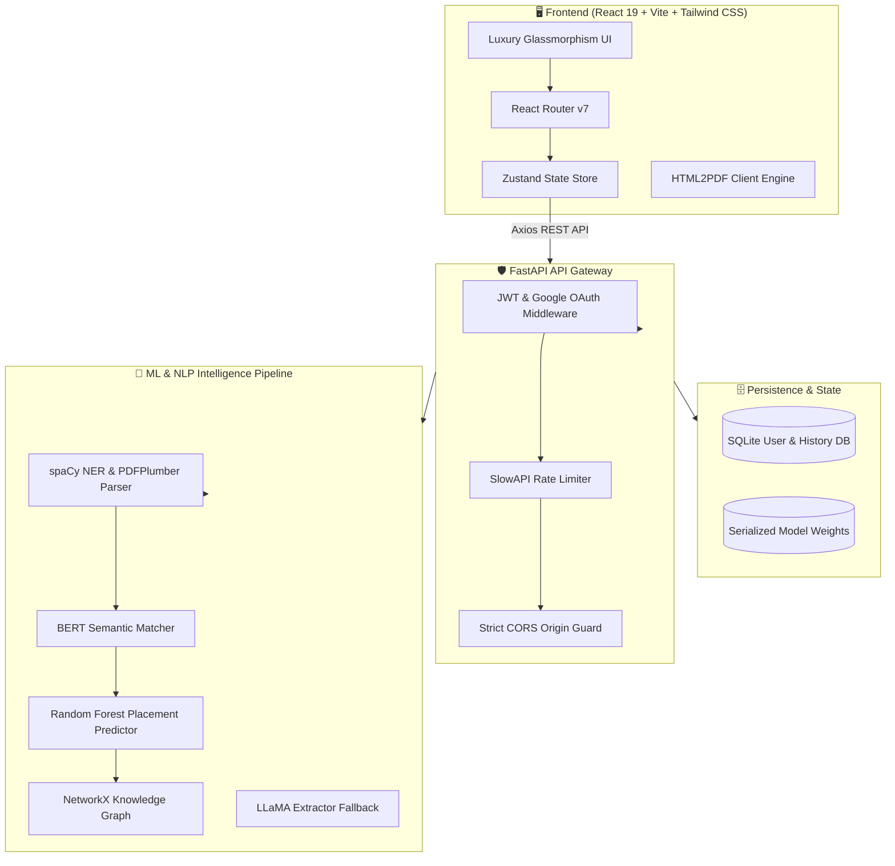

<div align="center">

# 🚀 HRCV : AI-Powered Career Intelligence Platform

### *Next-Generation 360° Talent Analysis, Semantic Resume Engineering & AI Career Acceleration*

[](LICENSE)
[](https://www.python.org/)
[](https://fastapi.tiangolo.com/)
[](https://react.dev/)
[](https://vitejs.dev/)
[](https://tailwindcss.com/)
[](https://scikit-learn.org/)
[](docker-compose.yml)
[](https://github.com/Priya-Ranjan-0201/HRCV-/actions)

<br/>

[🌟 Key Features](#-key-features) •
[🏛️ Architecture](#-system-architecture) •
[🛠️ Tech Stack](#️-technology-stack) •
[⚡ Quick Start](#-quick-start) •
[📡 API Reference](#-api-endpoints) •
[🤝 Contributing](#-contributing)

<br/>

</div>

---

## 🌟 Overview

**HRCV** is an enterprise-grade, AI-Powered Career Intelligence Platform engineered to bridge the gap between job candidates and top-tier engineering organizations. By uniting **Machine Learning (Random Forest)**, **Deep Natural Language Processing (spaCy & BERT Semantic Embeddings)**, and a **Modern Reactive UI**, HRCV provides candidates and recruiters with a complete, 360-degree talent intelligence system.

From automated ATS resume scoring and bullet-point rewriting to predictive salary modeling, interactive career trajectory mapping, GitHub code intelligence, and simulated behavioral/technical interview assessments—HRCV transforms career coaching into a data-driven science.

---

## 💎 Key Features

### 📄 1. Intelligent Resume Engineering
- **⚡ Neural Resume Scanner**: Upload any PDF resume and receive instant placement probability across Tier-1 tech firms (Google, Microsoft, Amazon, Meta, Apple, etc.) with Explainable AI factor weights.
- **📊 ATS Compatibility Grader (`/ats-score`)**: Multi-dimensional 0–100 scoring engine analyzing typography, parseability, section hierarchy, action verbs, and keyword density with actionable fix suggestions.
- **✨ AI Rewrite Studio (`/ai-rewrite`)**: Turn passive, weak bullet points into high-impact, XYZ-formula achievement statements with quantifiable metrics and active verbs.
- **🛠️ Interactive Resume Builder (`/resume-builder`)**: Real-time drag-and-drop resume editor with 6 battle-tested executive and engineering templates (Cascade, Cubic, Crisp, Aria, Apex, Nexus) and one-click PDF export.
- **📁 Resume Version History (`/resume-history`)**: Secure cloud history tracking of uploaded and parsed resumes with score progress analytics.

### 🎯 2. Career Navigation & Market Intelligence
- **🎯 Semantic JD Matcher (`/jd-match`)**: Compare your CV against any job description using BERT embedding cosine similarity to spot keyword alignment, core qualifications, and missing competencies.
- **🗺️ Dynamic Career Roadmap (`/career-roadmap`)**: Milestone-by-milestone growth plans tailored to your career trajectory (Frontend ➔ Full-Stack ➔ Staff Architect).
- **📈 Skill Gap Navigator (`/skill-gap`)**: Automated knowledge graph analysis highlighting missing skills with direct links to curated learning resources.
- **💰 AI Salary Predictor (`/salary-predict`)**: Estimate compensation benchmarks (Base, Bonus, Equity) indexed by role, years of experience, primary tech stack, and geographic location.

### 🐙 3. Developer & Recruiter Intelligence
- **🐙 GitHub Intelligence & Portfolio Analyzer (`/portfolio-analyzer`)**: Deep GitHub profile scanner calculating repository quality scores, commit consistency, tech stack distribution, and code health.
- **🎤 AI Interview Simulator (`/interview-simulator`)**: Real-time interactive interview prep with dynamically generated technical, behavioral, and system design questions and instant speech/text feedback.
- **🏆 Recruiter Talent Dashboard (`/dashboard`)**: Multi-candidate ranking, comparative side-by-side evaluations, and CSV/PDF candidate export.

---

## 🏛️ System Architecture



---

## 🛠️ Technology Stack

| Domain | Technology | Description |
|:---|:---|:---|
| **Frontend Framework** | **React 19** + **Vite 8** | Ultra-fast client-side reactive rendering & hot reloading |
| **Styling & Motion** | **Tailwind CSS 4** + **Framer Motion** | Premium dark-mode glassmorphic design system with micro-interactions |
| **State & Routing** | **Zustand** + **React Router v7** | Lightweight state management and fluid page routing |
| **Backend Framework** | **FastAPI 0.110** + **Uvicorn** | High-performance asynchronous Python REST API |
| **Machine Learning** | **Scikit-Learn** + **NumPy** + **Pandas** | Trained Random Forest classification pipeline & synthetic data generator |
| **NLP & Semantics** | **spaCy** (`en_core_web_sm`) + **Sentence-Transformers** | Deep entity extraction and BERT cosine semantic similarity matching |
| **Security & Auth** | **JWT (python-jose)** + **Passlib (bcrypt)** + **OAuth 2.0** | Cryptographic token auth, brute-force lockout & Google OAuth verification |
| **Testing Suite** | **Pytest** + **Vitest** + **Playwright** | Full end-to-end, integration, and unit testing coverage |
| **DevOps & Containers**| **Docker** + **Docker Compose** + **GitHub Actions** | Automated CI/CD, lint checks, and multi-stage container deployments |

---

## ⚡ Quick Start

### 🐳 Option A: Docker Compose (Recommended — Zero Setup)

Run the entire platform (Frontend + Backend + ML Engine) with a single command:

```bash
# 1. Clone repository
git clone https://github.com/Priya-Ranjan-0201/HRCV-.git
cd HRCV-

# 2. Copy environment template
cp .env.example .env

# 3. Launch containers
docker compose up --build
```

- 🌐 **Frontend**: [http://localhost:5173](http://localhost:5173)
- 🔗 **Backend API**: [http://localhost:8000](http://localhost:8000)
- 📖 **Interactive Swagger Docs**: [http://localhost:8000/docs](http://localhost:8000/docs)

---

### 💻 Option B: Local Manual Setup

#### 1. Prerequisites
- **Node.js**: v18.0.0+ (v20+ recommended)
- **Python**: v3.11+ or v3.12+
- **Git**

#### 2. Backend Setup
```bash
# Navigate to backend directory
cd backend

# Create and activate virtual environment
python -m venv .venv
# Windows (PowerShell):
.\.venv\Scripts\Activate.ps1
# macOS / Linux:
# source .venv/bin/activate

# Install dependencies
pip install --upgrade pip
pip install -r requirements.txt
pip install -r requirements-dev.txt

# Start FastAPI development server
uvicorn main:app --reload --port 8000
```
> 💡 *Note: On first startup, the ML model (`model.pkl`) will be trained automatically via `synthetic_data.py` (takes ~15 seconds).*

#### 3. Frontend Setup
```bash
# Open a new terminal in the frontend directory
cd frontend

# Install Node dependencies
npm install

# Start Vite dev server
npm run dev
```

Visit [http://localhost:5173](http://localhost:5173) in your browser.

---

## 📡 API Endpoints

### 🔍 Core Analysis & Intelligence
| Method | Route | Description |
|:---|:---|:---|
| `POST` | `/analyze` | Upload resume PDF, parse entities, compute placement probability & skill gaps |
| `GET` | `/companies` | List all supported benchmark organizations |
| `GET` | `/metrics` | Retrieve ML model accuracy, precision, and training performance metrics |
| `GET` | `/market-pulse` | Real-time market demand metrics across engineering skills |
| `POST` | `/evaluate-answer` | AI evaluation of candidate interview answers |

### 🔐 Authentication & Session
| Method | Route | Description |
|:---|:---|:---|
| `POST` | `/auth/register` | Register new user with encrypted credentials & device fingerprint |
| `POST` | `/auth/login` | Authenticate user with rate limiting & lockout protection (returns JWT) |
| `POST` | `/auth/google` | Verify Google OAuth token and establish session |
| `GET` | `/auth/me` | Retrieve authenticated user profile |

### ✨ AI Feature Studio (v3.0.0)
| Method | Route | Description |
|:---|:---|:---|
| `POST` | `/features/ats-score` | Compute detailed ATS score breakdown and recommendation checklist |
| `POST` | `/features/rewrite` | AI transformation of resume sentences into action-oriented bullet points |
| `POST` | `/features/jd-match` | Semantic BERT similarity analysis between resume and job description |
| `POST` | `/features/roadmap` | Generate customized step-by-step career milestones |
| `POST` | `/features/salary-predict` | Predict salary compensation bands across experience and skillsets |
| `POST` | `/features/github-stats` | Analyze GitHub repository metrics, commit trends, and code quality |
| `POST` | `/features/portfolio-analyze` | Multi-platform portfolio health score (GitHub, LinkedIn, LeetCode) |
| `POST` | `/features/interview/question` | Generate tailored interview questions by role and seniority |
| `POST` | `/features/interview/evaluate` | Grade candidate interview answers with strengths & growth areas |
| `POST` | `/features/recruiter/compare` | Multi-candidate ranking and side-by-side talent scoring |
| `GET` | `/features/skill-gap-recommendations` | Fetch curated learning resources for missing competencies |

---

## 🧪 Testing & Code Quality

Both frontend and backend are covered by automated unit, integration, and linting test suites.

```bash
# ── Backend Tests (Pytest, Black, Ruff) ──
cd backend
.\.venv\Scripts\pytest.exe tests/ -v      # Run all 30 unit & integration tests
.\.venv\Scripts\black.exe --check .       # Check code formatting
.\.venv\Scripts\ruff.exe check .          # Lint Python codebase

# ── Frontend Tests (Vitest, ESLint, Build) ──
cd frontend
npm run lint                              # ESLint verification (0 errors)
npm run test                              # Vitest suite
npm run build                             # Verify production build bundle
```

---

## 📁 Repository Structure

```
HRCV-/
├── .github/
│   └── workflows/
│       ├── backend-ci.yml         # Python 3.12 CI (Black, Ruff, Pytest)
│       ├── frontend-ci.yml        # Frontend CI (ESLint, Vitest, Build, Pages Deploy)
│       ├── keepalive.yml          # Render 24/7 backend ping scheduler
│       ├── render-deploy.yml      # Render deployment hook trigger
│       └── security.yml           # CodeQL & dependency security scanner
├── backend/
│   ├── main.py                    # FastAPI application gateway
│   ├── pyproject.toml             # Ruff, Black, and Pytest configuration
│   ├── requirements.txt           # Production Python dependencies
│   ├── requirements-dev.txt       # Dev & test dependencies
│   ├── auth/                      # JWT auth, user DB & Google OAuth
│   ├── ml_pipeline/               # Random Forest model, BERT matcher & NLP graphs
│   ├── routes/                    # Feature endpoints & version history
│   ├── utils/                     # PDF parser, rate limiter, logger & middleware
│   └── tests/                     # 30 comprehensive Pytest test cases
├── frontend/
│   ├── src/
│   │   ├── App.jsx                # App router, global nav, and layout
│   │   ├── components/            # Reusable UI components, modals, inputs
│   │   ├── pages/                 # 15+ Feature and analytical pages
│   │   ├── services/              # Axios API client & backend readiness guards
│   │   └── store/                 # Zustand state management
│   ├── package.json               # Node dependencies & scripts
│   ├── eslint.config.js           # ESLint configuration
│   └── vite.config.js             # Vite 8 configuration
├── docker-compose.yml             # Docker orchestrator for multi-service setup
├── render.yaml                    # Render Web Service blueprint
├── .env.example                   # Environment configuration template
├── .gitignore                     # Git exclusion rules
├── CONTRIBUTING.md                # Contribution guidelines
├── CODE_OF_CONDUCT.md             # Contributor code of conduct
├── LICENSE                        # MIT License
└── README.md                      # Platform documentation
```

---

## 🤝 Contributing

Contributions make open source an amazing place to learn, inspire, and create! Any contributions you make are **greatly appreciated**.

1. **Fork the Project** (`https://github.com/Priya-Ranjan-0201/HRCV-/fork`)
2. **Create your Feature Branch** (`git checkout -b feat/AmazingFeature`)
3. **Commit your Changes** (`git commit -m 'feat: Add some AmazingFeature'`)
4. **Push to the Branch** (`git push origin feat/AmazingFeature`)
5. **Open a Pull Request**

Please read our [Contributing Guidelines](CONTRIBUTING.md) and [Code of Conduct](CODE_OF_CONDUCT.md) before submitting a PR.

---

## 📜 License

Distributed under the **MIT License**. See [`LICENSE`](LICENSE) for more information.

---

<div align="center">

### 👨‍💻 Developed with ❤️ by **[Priya Ranjan](https://github.com/Priya-Ranjan-0201)**

⭐ **Star this repository if you find HRCV helpful!**

</div>
